# ORIE 4741 Group Project Midterm Report
## Covid-19 Vaccine Discovery

**Group Members: Meiqi Wu(mw849), Yuwei Liu (yl3388), Jialiang Sun(js3553), Vaish Gajaraj (vg289)**

### Data Description

The file input_bcell.csv and input_sars.csv contain 14387 and 520 samples with labels respectively, and we use both of them as to build model for our project. The file input_covid.csv contains only features but not labels, and our goal is to use the model that we build from input_bcell.csv and input_sars.csv to predict the label for data points in input_covid.csv.   
    
The input_bcell.csv and input_sars.csv contain the same columns. The column `target` is the label we want to predict. There are a total of 13 feature columns in the dataset, but we are only using 10 of them. We list the 13 features below.

- `parent_protein_id`: ID of parent protein.   
- `protein_seq`: Sequence of parent protein.   
- `start_position`: Start position of the peptide in the parent protein.  
- `end_position`: End position of the peptide in the parent protein. 
- `peptide_seq`: Sequence of peptide.
- `chou_fasman`: A feature of the peptide describing beta return.
- `emini`: A feature of the peptide describing relative surface accessibility.
- `kolaskar_tongaokar`: A feature of the peptide describing antigenicity. 
- `parker`: A feature of the peptide describing hydrophobicity.
- `isoelectric_point`: A feature of the parent protein. 
- `aromaticity`: A feature of the parent protein.
- `hydrophobicity`: A feature of the parent protein.
- `stability`: A feature of the parent protein. 
  

The features we dropped are `parent_protein_id`, `protein_seq` and `peptide_seq`. Among them, `protein_seq` and `peptide_seq` are sequences of the parent protein and extracted peptide, respectively. Exploiting these features would possibly involve sequential models, and require much more time and effort. Right now, we would not include them in the features, but in the future, if we get more time, we will consider exploring them using sequential models. 
     
There are no missing values in the 11 columns we are using. We checked by `IsNull()` in the `pandas` package. We dropped duplicate records and got a final dataset of 14896 records. Our dataset has 761 unique parent proteins and 14841 unique peptides, which means that there are a number of combinations of protein and peptide with different features. We aim to learn from those combinations about what features are most important for us to determine the presence of positive antibody valence. We found there are 4032 target records, against 10864 non-target records. The average rate of positive antibody valence in our dataset is 27.07%.   
     

### Exploratory Data Analysis

Before we use models to predict the positive antibody valence, we first explored each feature and tried to find some implications. We split all features into two parts, one containing peptide features, the other containing parent protein features. We visualized the differences between each feature’s distribution, and compared the mean of each feature from target and non-target groups. We identified distinct differences of both peptide and parent protein features between target and non-target groups. 

For peptide features, we compared peptide length, `chou_fasman` (beta return), `emini` (relative surface accessibility), `kolaskar_tongaonkar` (antigenicity) and `parker` (hydrophobicity).   
    
Peptide length is calculated by subtracting peptide start position from end position. The length is integer. The distribution of peptide length is highly right skewed, meaning that most peptides have a short length with a mean of 5, while there are several peptides as long as 393. Target and non-target groups have similar distribution of peptide lengths. When we explored the percentage of target records against peptide length, we found that peptides with lengths from 10 to 12 have the highest proportion to display positive antibody valence.    

​    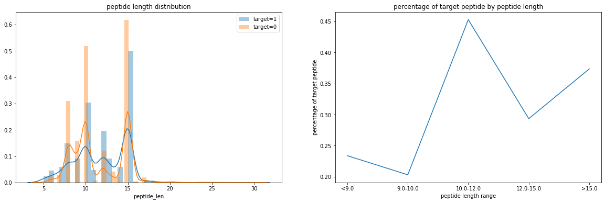

For other peptide features, we found `chou_fasman`, `kolaskar_tongaonkar` and `parker` are all normally distributed, while `emini` is right skewed. In terms of differences between target and non-target groups, we found the target group tends to have a higher value for `chou_fasman`, `emini` and `parker`. While for `kolaskar_tongaonkar`, the non-target group has a higher value. All differences are statistically significant under 0.05 significance level.    
     

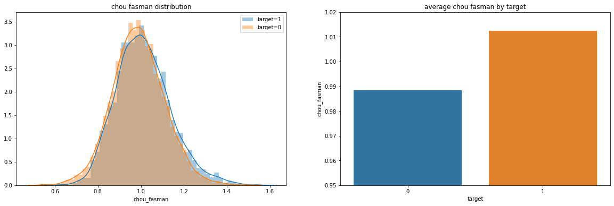
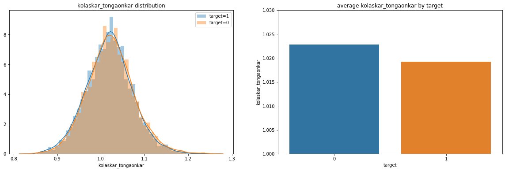
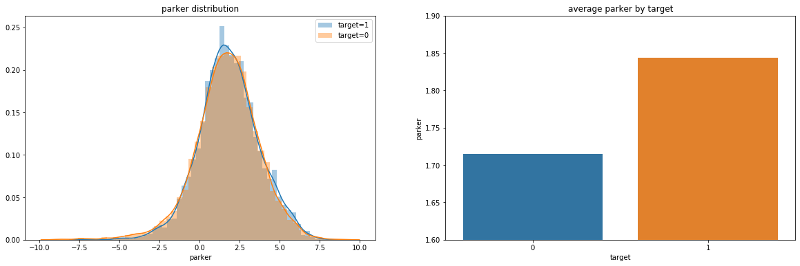

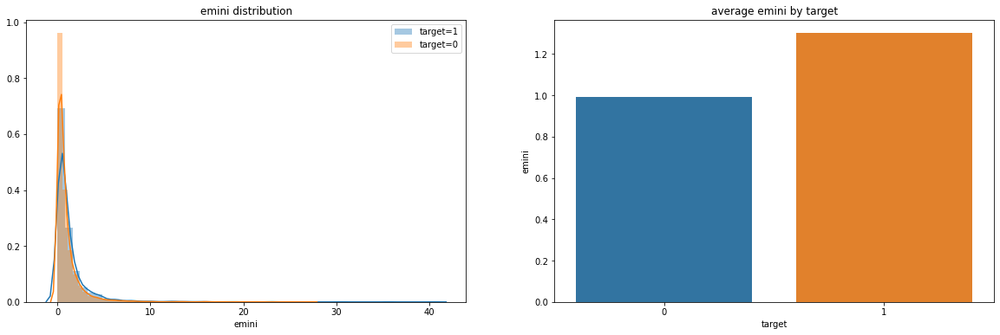

For parent protein features, we compared `isoelectric_point`, `aromaticity`, `hydrophobicity` and `stability`. We found that the target group shows a higher value for `aromaticity`, `hydrophobicity` and `stability`, while the non-target group displays a higher value for `isoelectric_point`. All differences are statistically significant under 0.05 significance level. 

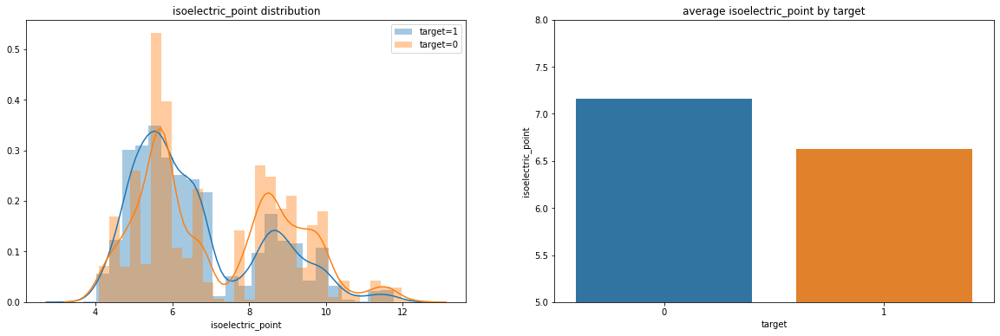

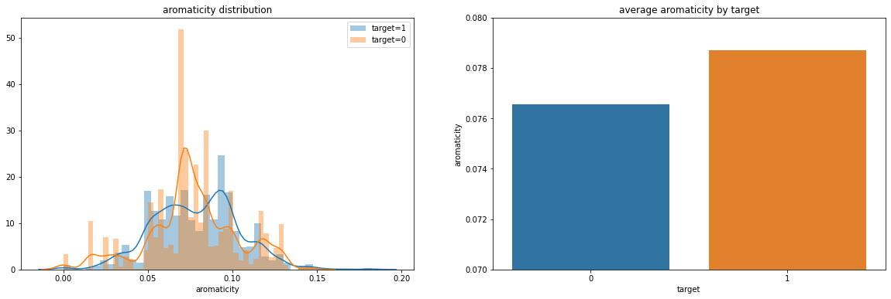

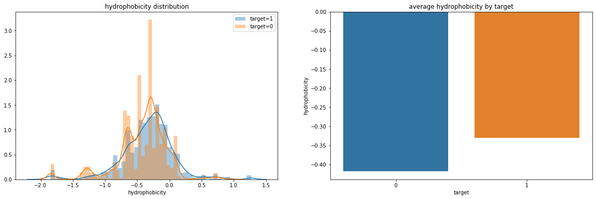
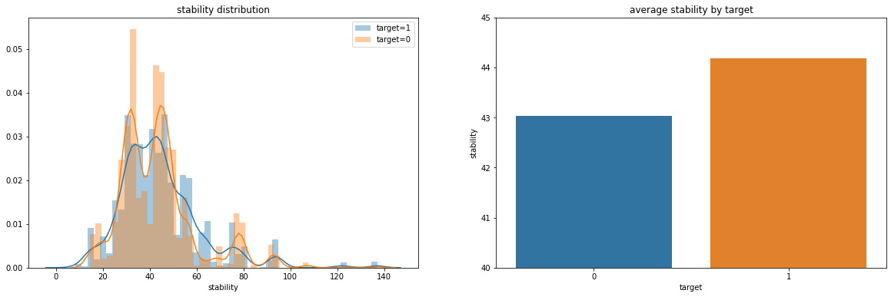

Since linear correlated variables would break the assumptions of some linear models, we checked the correlation of our variables by creating a correlation matrix. The matrix shows that our variables are not linearly correlated. Therefore we could apply linear models to estimate. 

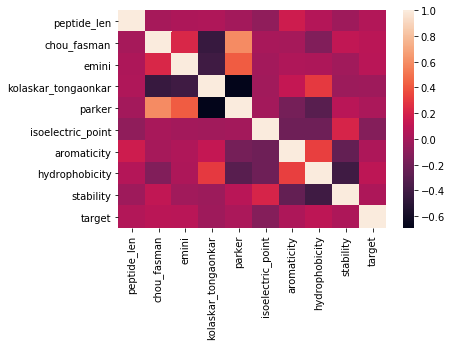

### Preliminary Analyses

For data preprocessing, we split the dataset into two sets, with 20% in the test set and 80% in the training set, and then utilized `StandardScaler` in the `scikit-learn` package to normalize the features to have zero mean and unit variance. It is worth noting that the scalar is trained on the training data instead of the whole dataset to avoid data leakage. 

We decided to use some simple supervised learning models to fit our data. Given that our target label, column “target”, only has value zero or one, it is not suitable to use linear regression, which will give prediction values other than zero or one. Then we decided to have a try on logistic regression and random forest.

In the first logistic regression model, we utilized the “LogisticRegression” function from sklearn package with a maximum iteration of 10000 to fit in the training dataset. The result gives us a model with coefficients (shown in table 1).

<h4>Table 1. Plain Logistic Regression Coefficients and Intercept</h4> 

| Variables | Coefficients |
| --- | --- |
| start_position | -1.2642 |
| end_position | 0.9802 |
| chou_fasman | 0.2407 |
| emini | 0.1310 |
| kolaskar_tongaonkar | -0.1009 |
| parker | -0.1664 |
| isoelectric_point | -0.3602 |
| aromaticity | 0.0313 |
| hydrophobicity | 0.2842 |
| stability | 0.2238 |
| intercept | -1.0596 |

The results indicate that the larger `end position` of the peptide, `chou fasman`, `emini`, `aromaticity` , `hydrophobicity`, and `stability` may contribute to a larger possibility of positive antibody valence, namely target value of 1. While larger value of `start position` of peptide, `kolaskar_tongaonkar`, `parker`, and `isoelectric_point` may contribute to a smaller possibility of positive antibody valence.

To check the predictive power of the model, we calculated MSE for both the training set and test set, which are 0.2638 and 0.2695 respectively. The explained variances of the training set and test set are -0.0295 and -0.0771 respectively (negative explained variance is impossible in linear regression but possible in logistic regression). The negative explained variances indicate that the plain logistic regression model does not fit the data well. Hence, we add regularizer to the logistic regression and see if there is an improvement.

We used $l2$ regularization with regularizer values in the set {$0.00001\times4^i : i=0,1,2,...,15$}, and then plot the training error and test error concerning the regularizer value as follows.

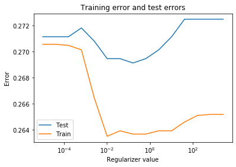

The regularized logistic regression gives the lowest test error when the regularizer is 0.1638. Then we use this model to predict on the training dataset and test dataset, the result still gives us negative explained variances (-0.0289 and -0.073 respectively). Hence, the logistic regression model is probably not suitable for our project.

Then we tried the random forest model. We used the “RandomForestClassifier” function from the sklearn package to build the model, setting the number of estimators to be 100 and the maximum depth to be 10. The new model gives us explained variances for the training dataset and test dataset of 0.4815 and 0.1836. The random forest model does a better job than the logistic regression, both explained variances are positive, yet not very high. Also, the test set explained variance is much smaller than that of the train set, which might be due to overfitting. Hence, we will adjust the model parameters or even the model in the later steps to improve the model performance.

<h4 align="center">Table 2. Logistic Regression and Random Forest Models’ results</h4> 

|Models|Logistic regression 1 (Train dataset)|Logistic regression 1 (Test dataset)|Logistic regression 2 (Train dataset)|Logistic regression 2 (Test dataset)|Random forest (Train dataset)|Random forest (Test dataset)|
|---|---|---|---|---|---|---|
|Explained variance|-0.0295|-0.0771|-0.0289|-0.073|0.4836|0.1869|
|$r^2$|-0.3365|-0.3635|-0.336|-0.3618|0.4553|0.1527|
|MSE|0.2638|0.2695|0.2637|0.2691|0.1075|0.1674|

### Future steps

There might be a further benefit in combining the most important features into a principal component. We can use this method to observe whether or not our regression models improve and if we can reduce some model noise. It might for example aid in further humbling the Log 1 and Log 2 MSE’s, and perhaps reduce the overfitting of the Random Forest model. We should also consider adding more complex models to our data, such as gradient boosting or a deep learning model like convolutional neural nets. To train a CNN, we may need to provision some GPU space on a virtual machine. In the neural network model, we will also implement regularization, dropout, and label smoothing to prevent overfitting and improve the generalization of the model. 
